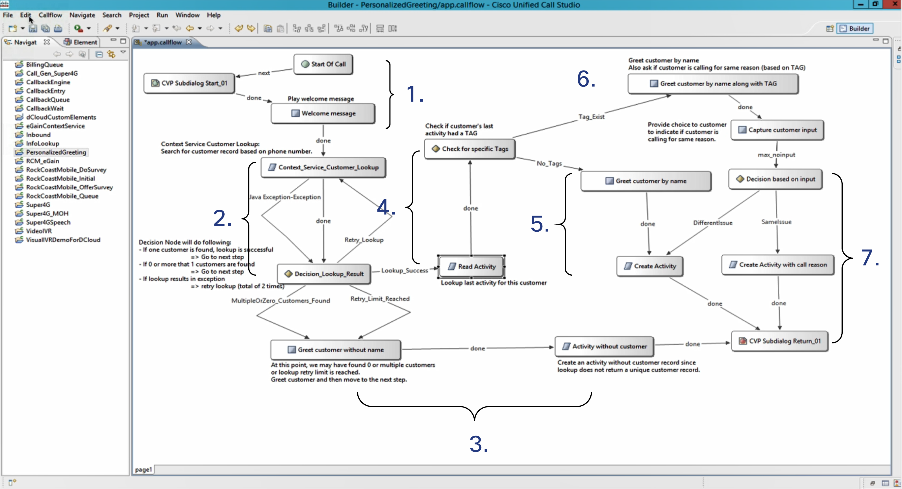
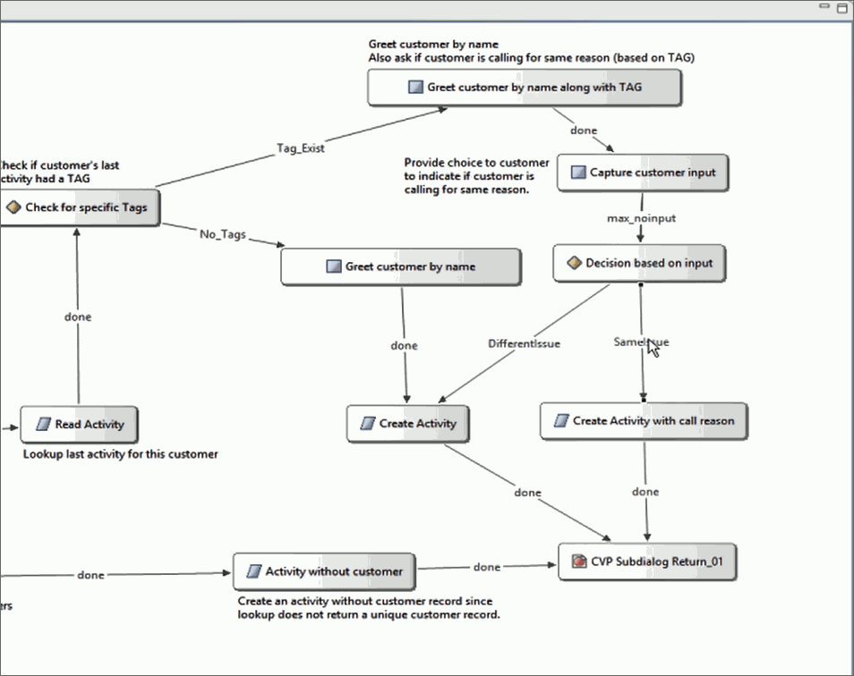

# Personalized IVR Experience
Use case projects demonstrate using Context Service to create a better customer experience.

This project uses customer and activity information stored in Context Service to:

* Deliver a personalized greeting to customers
* Route calls dynamically using Context Service tags
* Detect and route repeat callers
* Alter the IVR call flow if certain customer information is not available

## Prerequisites
This example project requires:
* Registering your organization with Context Service. For more information, see the Enable Context Service chapter of the [UCCE Features Guide](https://www.cisco.com/c/en/us/support/customer-collaboration/unified-contact-center-enterprise/products-feature-guides-list.html).
* Registering Unified Contact Center Enterprise (UCCE) version 11.5+ and its components with Context Service. For more information, see the Component Configuration and Registration chapter of the [UCCE Features Guide](https://www.cisco.com/c/en/us/support/customer-collaboration/unified-contact-center-enterprise/products-feature-guides-list.html).

## Download Personalized IVR Experience Project
Download the `PersonalizedGreeting` folder.

### Project Demonstration

https://www.youtube.com/embed/dwJ_UW--b-I

## Project Call Flow

>The numbers in the figure indicate call flow progression.

This project demonstrates a personalized customer experience using Context Service:

1. The call begins and the script plays a welcome message.

2. The script looks up the customer using their phone number.

3. The lookup returns no customer records, returns multiple records, or reaches the retry limit (three retries). The script then:
      1. Greets the customer without using their name. Because the customer lookup did not return a unique customer record, the customer's name cannot be determined.
      2. Creates an activity in Context Service. Because the customer lookup did not return a unique customer record, the activity is not associated with a customer.
      3. Transfers the call to an available agent through an ICM.
4. The lookup returns a unique customer record. The script then:
      1. Looks up the customer's most recent activity.
      2. Identifies if the customer's most recent activity has tags associated with it.
5. The customer's most recent activity does not have tags. The script then:
      1. Greets the customer by their name.
      2. Creates a new activity in Context Service. The activity is associated with the customer.
      3. Transfers the call to an available agent through an ICM.
6. The customer's most recent activity has a tag. The script then:
      1. Greets the customer by their name.
      2. Prompts the customer to answer if they are calling for the same reason as their last activity. The script uses the tag to determine the customer's reason for calling.

<ol start="7"><li>The script makes a decision based on the customer's input.
  <ol>If the customer is calling for a different reason than their last issue, the script:
    <li>Creates a new activity in Context Service. The activity is associated with the customer.</li>
    <li>Transfers the call to an available agent through an ICM.</li>
  </ol>
  <ol>If the customer is calling for the same issue, the script:
    <li>Creates a new activity in Context Service. This activity has the same reason for calling as the customer's last activity and is associated with the customer.</li>
    <li>Transfers the call to an available agent through an ICM.
</li>
  </ol>
</li>
</ol>

#### Add Custom Fields to Activities

This IVR script creates activities in Context Service as part of the call flow. You can customize what fields are used in these activities:

1. Create custom fields and add them to a fieldset using [Cisco Spark Control Hub](https://admin.ciscospark.com/) or the Context Service SDK. For more information on creating fields and fieldsets in Cisco Spark Control Hub, see [Manage Context Service Fields](https://collaborationhelp.cisco.com/article/en-us/hi6rbf). For more information on creating fields and fieldsets using the Context Service SDK, see [Create Custom Fields and Fieldsets](https://developer.cisco.com/docs/context-service/#fields-and-fieldsets).

2. In your IVR script, select an element in the call flow that creates an activity. In the Personalized IVR experience call flow, these elements include:

  * Activity without customer
  * Create activity
  * Create activity with call reason

3. Click **Fieldsets** and enter your chosen fieldsets as comma separated values. The Customer Context gadget dynamically displays the fields associated with your chosen fieldsets.

>The Finesse Customer Context gadget uses Context Service to display customer information and customer activities in Cisco Finesse.

## Get Started
Import the `PersonalizedGreeting` folder that you downloaded into CVP Call Studio as an existing project.
